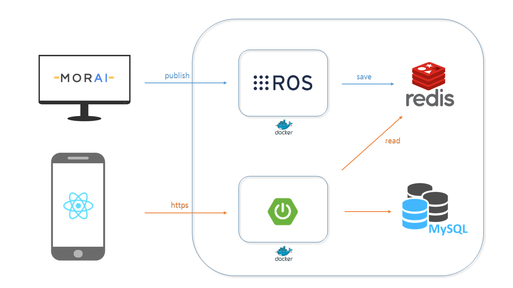

## 🚗 장소추천 자율주행 앱 서비스

## 	🚩 배경

차가 없어서, 새로운 장소에 대한 접근이 어려워서, 어디를 가야할지 몰라서! 여러가지 이유로 늘 같은 곳만 가셨나요?
택시를 타도 기사님들이 말을 거는게 불편하거나 면허가 없어서 렌트카를 빌리지 못하시지는 않으셨나요?
저희 서비스는 여러분을 위해 장소 추천과 코스 설정, 그리고 이동까지! 간편한 환경을 제공합니다

##  🚩 개요

저희 서비스에서는
1. 자율주행 택시 호출이 가능합니다.
2. 원하는 지역을 선택하면 장소 추천을 제공합니다.
3. 즐긴 장소와 코스에 대한 리뷰를 남기고 다른 사람들의 평을 확인할 수 있습니다.

사용자들은 쉬운 접근성으로 이동 장소 설정부터 실제 이동까지 하나의 모바일 앱에서 해결할 수 있습니다.

## 	🚩주요 기능

---
사용자가 앱을 통해 원하는 지역들을 선택하면, 장소와 코스를 추천합니다.
가상환경에서 사용자가 운전대를 잡지 않아도 원하는 목적지에 도착할 수 있는 자율주행 서비스를 제공합니다.

## 	🚩기능별 세부 사항

---
#### 장소와 경로 설정
- 다양한 기준을 바탕으로 장소를 추천(사용자의 별점)
- 카테고리별로 장소를 분류하여 사용자에게 제공
- 경로를 추천 받을 수 있음
- 선택한 경로에서 장소의 방문 순서를 변경할 수 있음
- 경로를 지도에 표시하여 사용자에게 보여줌

#### 실시간 위치 출력
- 지도에 위치를 실시간으로 출력
- 차량의 위치와 호출 위치 사이의 최적 경로를 생성한 후, 예상 소요 시간을 전송

#### 경로 생성
- 최단거리 경로 생성

#### 마이페이지
- 앱을 사용하는 동안의 기록들을 저장
- 방문 장소에 대한 별점을 확인
- 방문 경로에 대해 작성한 리뷰 확인

#### RC car
- 가상환경에서의 주행과 동기화된 주행 상태 구현
- 스피커를 부착하여 사용자의 플레이리스트 재생
- 모터를 추가하여 승하차시 문의 움직임을 구현

#### 결제
- 거리 및 시간을 기준으로 금액을 산출하여 영수증 형태로 제공
- 승차 확인 클릭과 동시에 자동 결제로 진행

## 	🚩주요 기술

---

## 🙆 협업 툴

---

- Git
- Notion
- JIRA
- MatterMost
- Webex

## 🙆 협업 환경

---

- Gitlab
  - 코드 버전 관리
  - Jira와 연동하여 일정 관리
  - 커밋 컨벤션 준수
- JIRA
  - 매주 일정에 따른 업무를 할당하여 Sprint 진행
  - JIRA 컨벤션 준수
- 회의
  - 아침마다 스크럼 회의 진행
  - 주별로 전 파트 코드리뷰 진행
  - 그라운드 룰 준수
- Notion
  - 각종 문서 아카이빙과 회의록 보관
  - 기능명세서, 이해관계자, 유즈케이스 시나리오 등 문서 보관
  - 코딩 컨벤션 정리
  - 프로젝트 일정 정리
  - 그라운드 룰 명시

## 🙆  팀원 역할 분배

---
- 주해린 : PM, Mobility
- 심정윤 : Moblility
- 조성환 : Moblility, 서기, 발표
- 김인중 : Backend, Frontend
- 이신광 : Backend, CI/CD
- 오현규 : Backend, Frontend, UI/UX

## 	🚩 프로젝트 산출물

---

- [기능명세서](https://lab.ssafy.com/s08-mobility-autodriving-sub1/S08P21A408/-/blob/2324b6a3f21ab1c4daab91d62235f1a0ba81d2f3/docs/%EA%B8%B0%EB%8A%A5%EB%AA%85%EC%84%B8%EC%84%9C.png)
- [이해관계자 파악 및 분석]()
- [Swagger UI]()
- [페르소나]()
- [ERD](https://lab.ssafy.com/s08-mobility-autodriving-sub2/S08P22A408/-/blob/main/Docs/ERD.PNG)
- [Usecase 다이어그램]()
- [Usecase Scenario]()

## Feature List

[Google Sheet를 통해 기능 명세서 보기](https://docs.google.com/spreadsheets/d/1_x7AEmibMF-szTzUB5i6ekQn2jWMi7hplkFVeeMDTS8/edit?usp=sharing)

## Story Board

[Figma를 통해 스토리 보드 보기](https://www.figma.com/signup?is_not_gen_0=true&resource_type=team)

